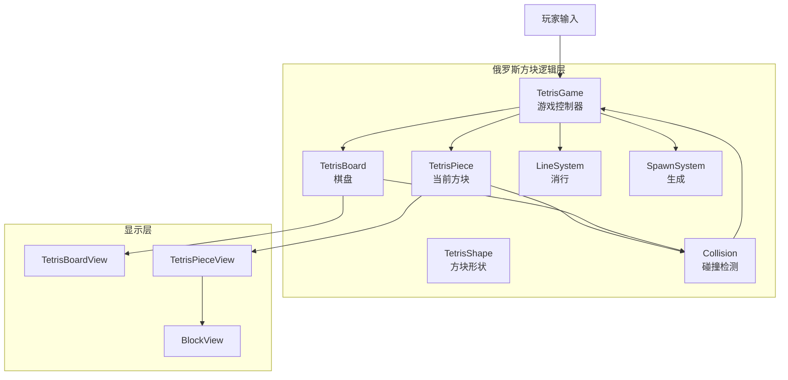
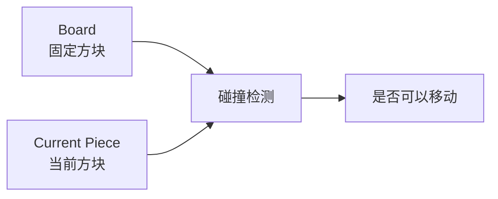
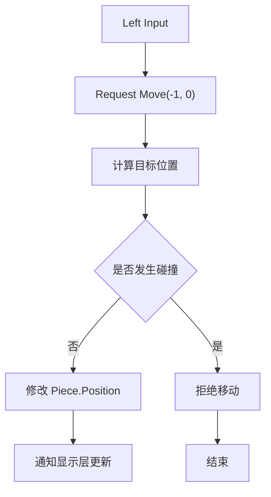
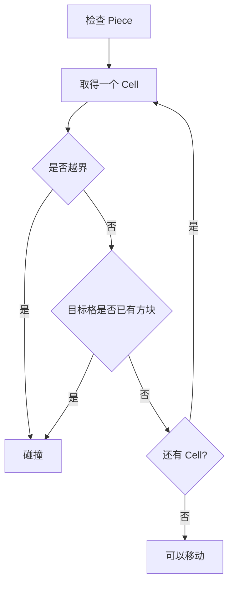
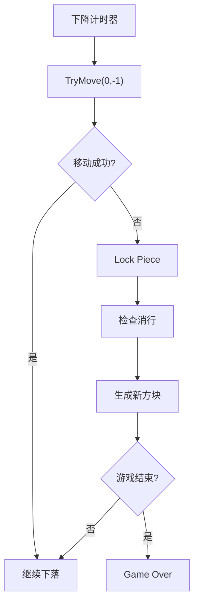
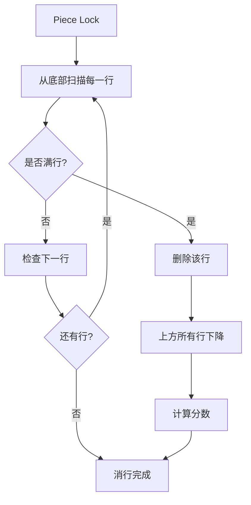
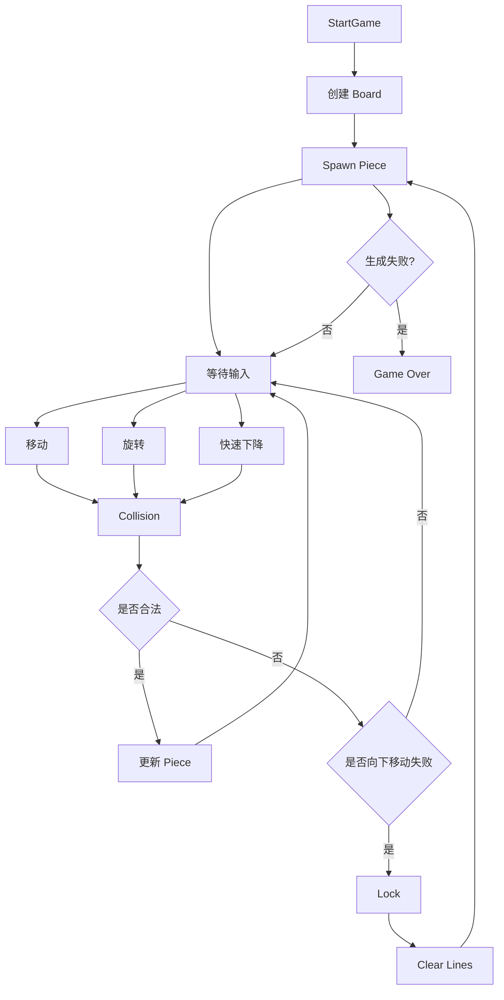
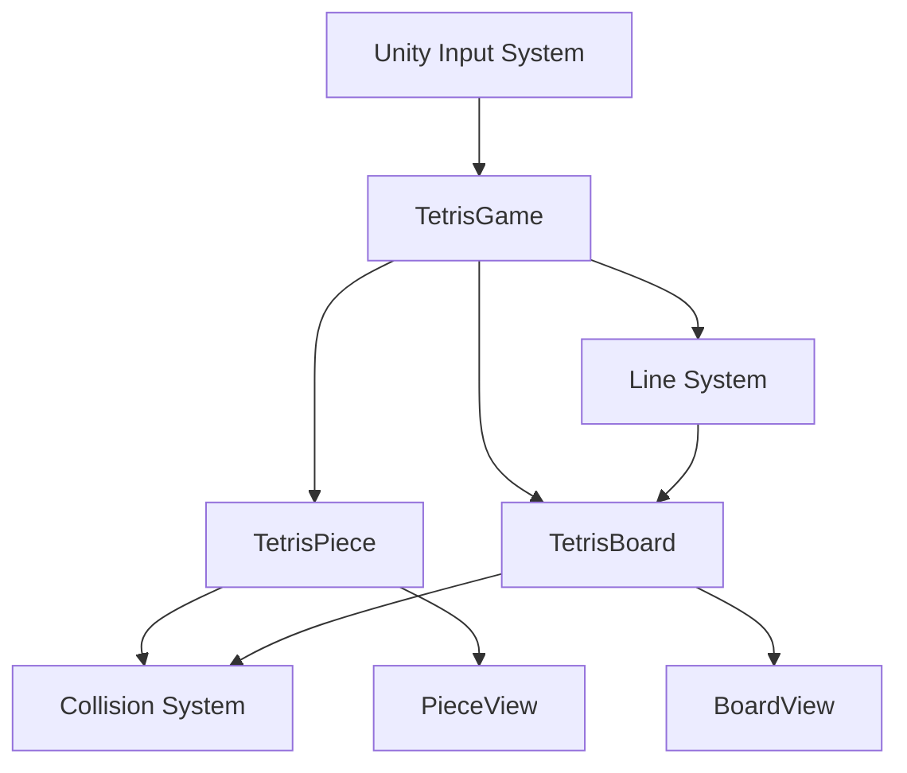
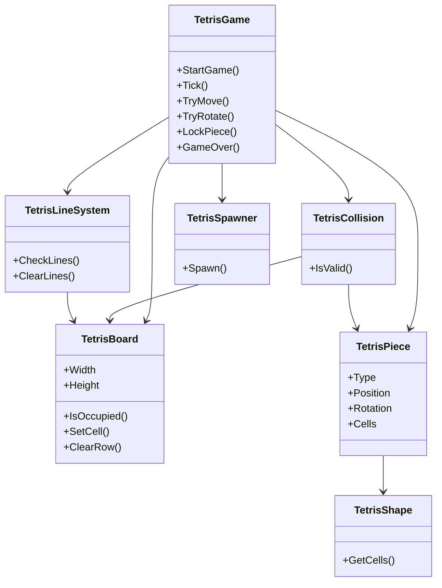

在 Unity 中搭建俄罗斯方块，**建议先把“逻辑层”和“显示层”彻底分开**。

核心原则是：

> **逻辑层只负责“方块应该在哪里、能不能移动、能不能旋转、是否消行”。**
>
> **Unity GameObject / Transform 只负责“把逻辑结果显示出来”。**

这样后面无论使用 2D Sprite、UI、3D Cube，甚至做网络同步，都不会影响俄罗斯方块核心玩法。

---

# 一、整体架构

可以先建立这样的结构：



其中最重要的是：

```text
Input
  ↓
Game
  ↓
Logic
  ↓
View
```

而不是：

```text
Input
  ↓
Transform
  ↓
Physics
  ↓
GameObject
```

俄罗斯方块**不需要依赖 Unity Physics 来判断方块碰撞**。

---

# 二、俄罗斯方块逻辑层应该有哪些对象

推荐最开始只设计 6 个核心对象：

```text
TetrisGame
├── TetrisBoard
├── TetrisPiece
├── TetrisShape
├── TetrisCollision
├── TetrisLineSystem
└── TetrisSpawner
```

职责如下：

| 对象                 | 职责                   |
| ------------------ | -------------------- |
| `TetrisGame`       | 控制整个游戏流程             |
| `TetrisBoard`      | 保存棋盘数据               |
| `TetrisPiece`      | 保存当前正在下落的方块          |
| `TetrisShape`      | 定义 I/O/T/S/Z/J/L 等形状 |
| `TetrisCollision`  | 判断移动、旋转是否合法          |
| `TetrisLineSystem` | 检查和删除完整行             |
| `TetrisSpawner`    | 生成下一个方块              |

---

# 三、最核心的数据结构：棋盘

俄罗斯方块本质上就是一个二维数组。

例如经典棋盘：

```text
10 × 20
```

可以表示为：

```csharp
private int[,] board = new int[10, 20];
```

或者：

```csharp
private Block[,] board = new Block[10, 20];
```

但是逻辑层建议不要存 `GameObject`。

例如：

```csharp
public enum BlockType
{
    Empty,
    I,
    O,
    T,
    S,
    Z,
    J,
    L
}
```

然后：

```csharp
public class TetrisBoard
{
    public const int Width = 10;
    public const int Height = 20;

    private BlockType[,] cells =
        new BlockType[Width, Height];
}
```

此时棋盘实际上就是：

```text
┌────────────────────┐
│                    │
│                    │
│                    │
│                    │
│                    │
│                    │
│                    │
│                    │
│                    │
│                    │
│                    │
│                    │
│                    │
│                    │
│                    │
│                    │
│                    │
│                    │
│                    │
│                    │
└────────────────────┘
       10 × 20
```

---

# 四、当前方块和固定方块要分开

这是俄罗斯方块逻辑非常重要的设计。

棋盘中实际上存在两种东西：

```text
已经固定的方块
        +
正在下落的方块
```

不要把正在下落的方块直接写入棋盘。

例如：

```text
Board

..........
..........
..........
....XX....
....XX....
..........
....XXX...
....XXX...
```

这里：

```text
XX
XX
```

可能是当前正在移动的 O 方块。

而：

```text
XXX
XXX
```

是已经固定在棋盘里的方块。

所以：



---

# 五、TetrisPiece 应该保存什么

当前方块至少需要：

```text
形状
位置
旋转状态
```

例如：

```csharp
public class TetrisPiece
{
    public BlockType Type;

    public Vector2Int Position;

    public int Rotation;
}
```

例如一个 T 方块：

```text
  X
 XXX
```

它可能位于：

```text
Position = (4, 18)
Rotation = 0
```

---

# 六、方块形状不要直接依赖 Transform

例如 T 方块可以用坐标描述：

```text
(1,0)
(0,1)
(1,1)
(2,1)
```

形成：

```text
.X.
XXX
```

因此：

```csharp
public static readonly Vector2Int[] TShape =
{
    new Vector2Int(1, 0),
    new Vector2Int(0, 1),
    new Vector2Int(1, 1),
    new Vector2Int(2, 1)
};
```

一个方块实际上可以理解成：

```text
TetrisPiece
     │
     ├── Position
     │
     ├── Rotation
     │
     └── Shape
            │
            ├── Cell 0
            ├── Cell 1
            ├── Cell 2
            └── Cell 3
```

---

# 七、移动的核心逻辑

例如玩家按：

```text
←
```

逻辑层不要直接：

```csharp
transform.position += Vector3.left;
```

而应该：

```text
请求移动
 ↓
计算目标位置
 ↓
检查目标位置是否合法
 ↓
合法 → 修改逻辑位置
非法 → 什么都不做
```

流程：



例如：

```csharp
public bool TryMove(Vector2Int direction)
{
    Vector2Int targetPosition =
        Piece.Position + direction;

    if (!Collision.IsValid(Piece, targetPosition))
        return false;

    Piece.Position = targetPosition;

    return true;
}
```

---

# 八、碰撞检测才是核心

假设当前 T 方块：

```text
.X.
XXX
```

要移动到：

```text
.X.
XXX
```

首先获得它的 4 个 Block 坐标。

例如：

```text
Piece Position = (4, 10)
```

那么：

```text
(5,10)
(4,11)
(5,11)
(6,11)
```

然后逐个检查。



因此：

```csharp
bool IsValid(
    TetrisPiece piece,
    Vector2Int position)
{
    foreach (var cell in piece.Cells)
    {
        Vector2Int boardPosition =
            position + cell;

        if (!IsInsideBoard(boardPosition))
            return false;

        if (Board.IsOccupied(boardPosition))
            return false;
    }

    return true;
}
```

这就是俄罗斯方块最核心的算法之一。

---

# 九、下落逻辑

俄罗斯方块本质上存在一个自动循环：

```text
计时器
 ↓
尝试向下移动
 ↓
成功 → 继续
失败 → 方块固定
```

流程：



---

# 十、固定方块

当：

```text
TryMove(0,-1)
```

失败的时候，并不是说方块消失。

而是：

```text
Current Piece
      ↓
写入 Board
      ↓
Current Piece 清空
```

例如：

```text
Before

..........
..........
....XX....
....XX....
..........
```

下落失败：

```text
Board.Add(Piece)
```

变成：

```text
..........
..........
....XX....
....XX....
```

此时：

```text
CurrentPiece = null
```

然后生成新的方块。

---

# 十一、消行

这是第二个核心算法。

假设：

```text
..........
..........
XXXXXX....
XXXXXXXXXX
XXXXXXXXXX
```

发现：

```text
Y = 18
Y = 19
```

两行完整。

删除：

```text
18
19
```

然后让上面的方块下降。

流程：



---

# 十二、旋转

旋转实际上也是：

```text
当前 Rotation
      ↓
计算新的 Rotation
      ↓
得到新的 Cell 坐标
      ↓
碰撞检测
      ↓
合法 → 应用
非法 → 拒绝
```

例如：

```text
旋转前

.X.
XXX
```

旋转：

```text
.X
.XX
.X
```

逻辑上：

```csharp
int nextRotation =
    (piece.Rotation + 1) % 4;
```

然后：

```csharp
if (Collision.IsValid(
        piece,
        piece.Position,
        nextRotation))
{
    piece.Rotation = nextRotation;
}
```

**不要旋转 Unity Transform 后再判断碰撞。**

应该：

> **先计算逻辑结果 → 判断 → 再修改 Transform。**

---

# 十三、完整的 Game 层

最终可以让：

```csharp
TetrisGame
```

成为整个游戏的入口。

大致结构：

```text
TetrisGame
│
├── StartGame()
│
├── SpawnPiece()
│
├── TryMove()
│
├── TryRotate()
│
├── Tick()
│
├── LockPiece()
│
├── ClearLines()
│
├── CheckGameOver()
│
└── GameOver()
```

逻辑流程：



---

# 十四、Unity 中推荐的实际目录

可以这样组织：

```text
Assets/
└── Tetris/
    │
    ├── Runtime/
    │   │
    │   ├── Core/
    │   │   ├── TetrisGame.cs
    │   │   ├── TetrisBoard.cs
    │   │   ├── TetrisPiece.cs
    │   │   └── TetrisShape.cs
    │   │
    │   ├── Systems/
    │   │   ├── TetrisCollision.cs
    │   │   ├── TetrisLineSystem.cs
    │   │   └── TetrisSpawner.cs
    │   │
    │   ├── View/
    │   │   ├── TetrisBoardView.cs
    │   │   ├── TetrisPieceView.cs
    │   │   └── TetrisBlockView.cs
    │   │
    │   └── Input/
    │       └── TetrisInput.cs
    │
    └── Editor/
```

---

# 十五、逻辑层和 Unity 显示层的关系

这是整个架构最值得注意的地方。



**逻辑层不应该知道：**

```text
GameObject
Transform
SpriteRenderer
Animator
ParticleSystem
UI
```

而显示层负责：

```text
Logic Position
      ↓
World Position
      ↓
Transform
```

例如：

```text
逻辑：

Piece.Position = (4, 15)

        ↓

View：

Transform.position =
    BoardToWorld((4,15))
```

这样就实现：

```text
┌──────────────────────────────┐
│        Logic Layer           │
│                              │
│ Board                        │
│ Piece                        │
│ Shape                        │
│ Collision                    │
│ Line Clear                   │
│ Game State                   │
└──────────────┬───────────────┘
               │
               │ 数据
               ↓
┌──────────────────────────────┐
│         View Layer           │
│                              │
│ GameObject                   │
│ Transform                    │
│ SpriteRenderer               │
│ UI                           │
│ Animation                    │
│ Effects                      │
└──────────────────────────────┘
```

---

# 十六、推荐的最终职责关系

如果你准备真正用 Unity 实现，我建议最终形成下面这个结构：



## 最重要的一句话

俄罗斯方块的逻辑层可以浓缩成：

```text
        输入
         ↓
    修改 Piece
         ↓
    碰撞检测
      ↙     ↘
   合法      非法
    ↓          ↓
 更新位置    拒绝
    ↓
向下移动失败？
    ↓
   Lock
    ↓
  消行
    ↓
生成 Piece
    ↓
继续游戏
```

也就是说，**俄罗斯方块并不是“控制很多 Cube 移动”**，而是：

> **维护一个二维棋盘状态 + 维护一个当前方块状态 + 不断执行“尝试移动 → 碰撞判断 → 固定 → 消行”的状态循环。**

如果按照这个思路实现，下一步最适合直接把它拆成 **`TetrisBoard + TetrisPiece + TetrisGame` 三个 C# 类**，先不用任何 Unity GameObject，就可以把完整俄罗斯方块玩法跑通。
