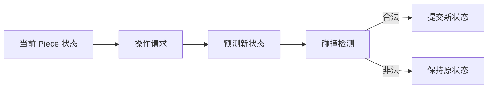
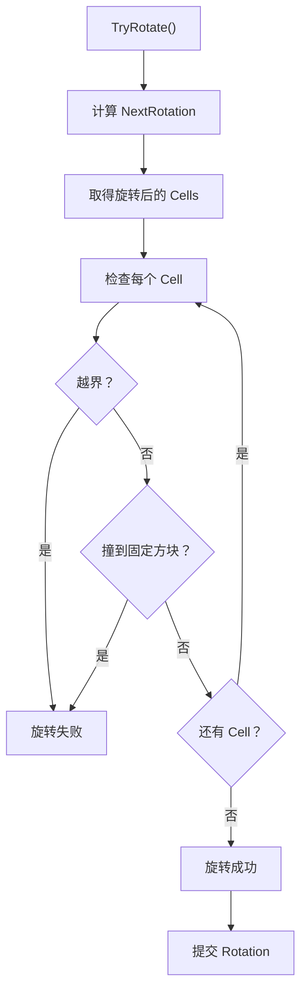
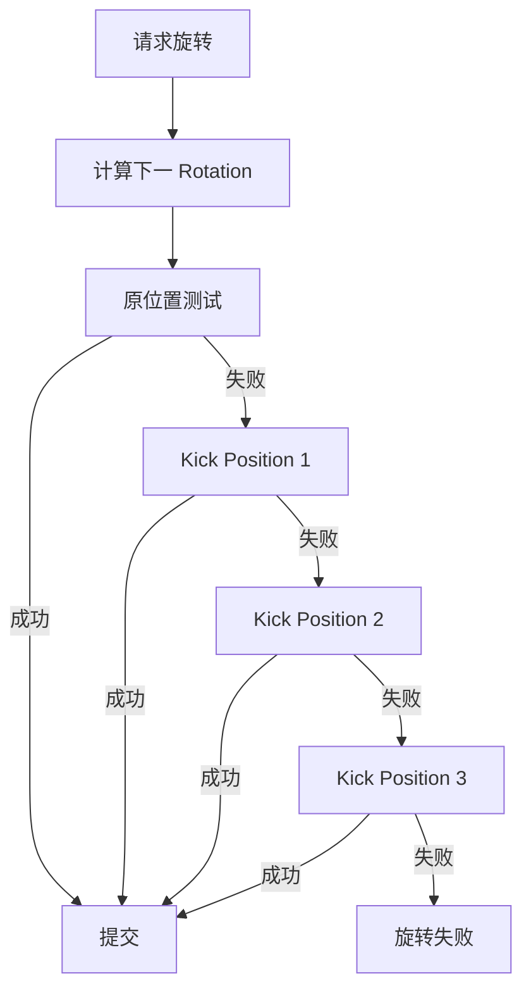

俄罗斯方块逻辑层处理“旋转”的方式，和移动非常类似：

> **旋转不是直接旋转 Transform，而是计算“旋转后的方块状态” → 碰撞检测 → 合法才提交旋转。**

可以把它理解成：

```text
当前状态
   ↓
请求旋转
   ↓
计算下一旋转状态
   ↓
计算旋转后的 Cell
   ↓
碰撞检测
   ↓
合法 → 提交
非法 → 保持原状
```

---

# 1. 旋转到底改变什么？

一个 `TetrisPiece` 通常有：

```text
TetrisPiece
├── Position
├── Rotation
└── Shape
```

例如：

```text
Rotation = 0

.X.
XXX
```

旋转一次：

```text
Rotation = 1

.X
.XX
.X
```

再旋转：

```text
Rotation = 2

XXX
.X.
```

所以旋转本质上不是：

```text
Position 改变
```

而是：

```text
Rotation 改变
```

即：

```csharp
piece.Rotation = nextRotation;
```

但同样需要先判断：

> **旋转之后的所有 Cell 是否仍然合法。**

---

# 2. 旋转和移动的逻辑完全类似

移动：

```text
Current Position
      ↓
Target Position
      ↓
碰撞检测
      ↓
提交 Position
```

旋转：

```text
Current Rotation
      ↓
Target Rotation
      ↓
碰撞检测
      ↓
提交 Rotation
```

所以可以统一理解成：



---

# 3. 最简单的旋转实现

假设每个方块有 4 个旋转状态：

```text
0 → 1 → 2 → 3 → 0
```

那么：

```csharp
int nextRotation =
    (piece.Rotation + 1) % 4;
```

例如：

```text
0 → 1
1 → 2
2 → 3
3 → 0
```

---

# 4. 旋转后如何得到新的 Cell？

这里有两种主要设计。

## 方案 A：提前定义旋转状态

这是俄罗斯方块最推荐的方式之一。

例如 T 方块：

```text
Rotation 0

.X.
XXX
```

```text
Rotation 1

.X
.XX
.X
```

```text
Rotation 2

XXX
.X.
```

```text
Rotation 3

X.
XX
X.
```

代码结构可以设计成：

```csharp
Vector2Int[][] rotations;
```

例如：

```text
Shape
 ├── Rotation 0
 │    ├── Cell
 │    ├── Cell
 │    ├── Cell
 │    └── Cell
 │
 ├── Rotation 1
 │    ├── Cell
 │    ├── Cell
 │    ├── Cell
 │    └── Cell
 │
 ├── Rotation 2
 └── Rotation 3
```

这样旋转时：

```csharp
piece.GetCells(nextRotation);
```

直接获得对应的 Cell。

---

# 5. 方案 B：数学旋转

也可以根据数学公式计算。

假设旋转中心为：

```text
(cx, cy)
```

一个 Cell：

```text
(x, y)
```

顺时针旋转 90°：

```text
x' = cx - (y - cy)
y' = cy + (x - cx)
```

也就是：

```text
(x,y)
      ↓
旋转中心
      ↓
(x',y')
```

不过对于俄罗斯方块来说，**实际开发更推荐使用预定义旋转状态**，因为不同方块的旋转中心并不完全一样。

---

# 6. 旋转碰撞检测

假设：

```text
当前：

....
.XX.
.XX.
....
```

尝试旋转。

逻辑层首先：

```text
CurrentRotation = 0

        ↓

NextRotation = 1
```

然后取得：

```text
Cells = Shape.GetCells(1)
```

接下来计算：

```text
Piece.Position
+
RotatedCell
```

然后逐个检查。



---

# 7. 核心代码

可以把旋转写成：

```csharp
public bool TryRotate()
{
    int nextRotation =
        (piece.Rotation + 1) % 4;

    if (!IsValidPosition(
            piece,
            piece.Position,
            nextRotation))
    {
        return false;
    }

    piece.Rotation = nextRotation;

    return true;
}
```

注意这里非常重要：

```csharp
IsValidPosition(
    piece,
    piece.Position,
    nextRotation
);
```

**Position 没变。**

变化的是：

```text
Rotation
```

所以：

```text
移动：

Position → 新 Position

旋转：

Rotation → 新 Rotation
```

---

# 8. 为什么旋转时有时候需要“踢墙”？

这是俄罗斯方块比较重要的机制：

> **Wall Kick**

例如：

```text
##########
       XX
       XX
```

如果方块靠近右墙：

```text
##########
        XX
        XX
```

直接旋转可能导致：

```text
##########
        X
        XX
        X
```

其中某个 Cell 超出棋盘。

如果简单逻辑：

```text
越界
 ↓
旋转失败
```

玩家会觉得旋转非常生硬。

现代俄罗斯方块通常会尝试几个备用位置：

```text
原位置
 ↓
旋转失败
 ↓
向左偏移 1
 ↓
检测
 ↓
失败
 ↓
向右偏移 1
 ↓
检测
 ↓
失败
 ↓
其他 Kick
```

---

# 9. Wall Kick 的逻辑

因此完整旋转其实是：



所以旋转实际上可以抽象成：

```text
Rotation
+
Position Offset
+
Shape
```

共同决定最终状态。

---

# 10. 旋转后的最终状态

假设：

```text
当前：

Position = (4,10)
Rotation = 0
```

玩家按旋转。

逻辑层先产生：

```text
Candidate State

Position = (4,10)
Rotation = 1
```

如果碰撞：

```text
Position = (3,10)
Rotation = 1
```

如果仍然碰撞：

```text
Position = (5,10)
Rotation = 1
```

如果都失败：

```text
保持：

Position = (4,10)
Rotation = 0
```

因此：

> **旋转本质上是寻找一个合法的“候选状态”。**

---

# 11. 推荐的数据结构

可以把 `Piece` 设计成：

```csharp
public class TetrisPiece
{
    public BlockType Type;

    public Vector2Int Position;

    public int Rotation;

    public Vector2Int[] GetCells()
    {
        return TetrisShapeDatabase
            .GetCells(Type, Rotation);
    }
}
```

而旋转：

```csharp
public bool TryRotate()
{
    int nextRotation =
        (piece.Rotation + 1) % 4;

    Vector2Int[] cells =
        TetrisShapeDatabase.GetCells(
            piece.Type,
            nextRotation);

    if (!collision.IsValid(
            piece.Position,
            cells))
    {
        return false;
    }

    piece.Rotation = nextRotation;

    return true;
}
```

这样职责非常清楚：

```text
TetrisPiece
    ↓
保存状态

TetrisShapeDatabase
    ↓
提供形状

TetrisCollision
    ↓
判断是否合法

TetrisGame
    ↓
决定是否提交
```

---

# 12. 移动和旋转最终可以统一

这实际上是搭建俄罗斯方块逻辑层最重要的地方。

不要设计成：

```text
MoveSystem
RotateSystem
FallSystem
```

完全独立。

而应该把它们理解成：

```text
        Piece State
             ↓
      ┌──────┴──────┐
      ↓             ↓
   Position       Rotation
      ↓             ↓
   移动请求        旋转请求
      └──────┬──────┘
             ↓
        Candidate State
             ↓
        Collision Check
             ↓
       ┌─────┴─────┐
       ↓           ↓
     合法         非法
       ↓           ↓
     Commit       Reject
```

最终：

```text
移动：
Position + Direction

旋转：
Rotation + 1

Wall Kick：
Position + Offset

下降：
Position + Down

快速下降：
不断 Position + Down
```

**它们最终都只是对 `TetrisPiece` 生成一个 Candidate State，然后交给同一个碰撞检测系统验证。**

这就是一个比较干净的俄罗斯方块逻辑层设计。
