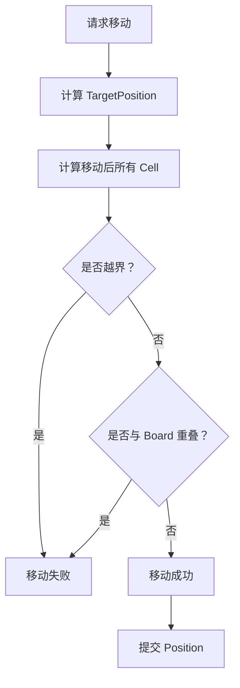
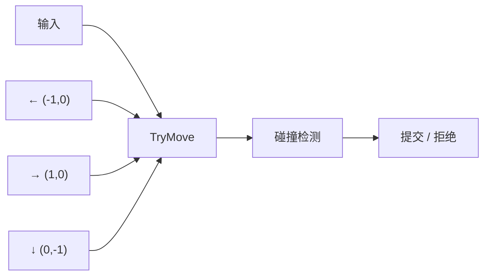
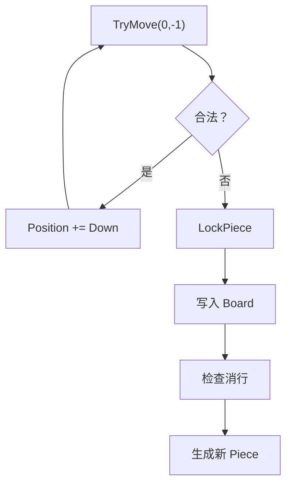
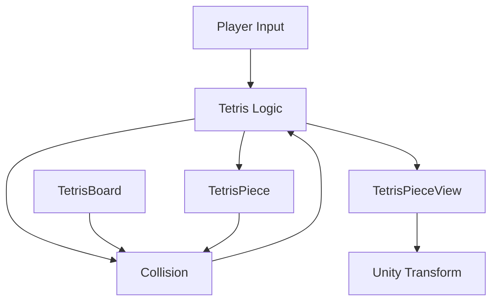
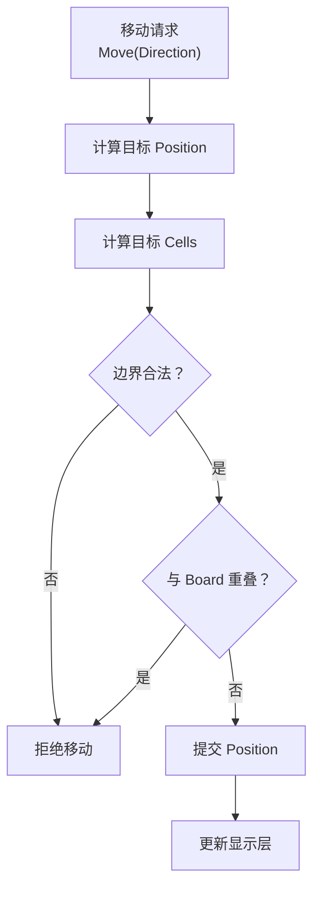

俄罗斯方块逻辑层处理“方块移动”的核心，可以概括成一句话：

> **不是直接移动方块，而是“尝试移动 → 计算目标位置 → 碰撞检测 → 合法则提交”。**

---

# 1. 逻辑层中的方块

逻辑层通常把当前方块抽象成：

```text
TetrisPiece
├── Position     方块整体位置
├── Rotation     旋转状态
└── Cells[]      方块由哪些格子组成
```

例如 `T`：

```text
 .X.
 XXX
```

可以表示成：

```text
Cells =
{
    (1, 0),
    (0, 1),
    (1, 1),
    (2, 1)
}
```

如果：

```text
Position = (4, 10)
```

那么实际占用棋盘：

```text
(5,10)
(4,11)
(5,11)
(6,11)
```

所以：

```text
实际格子坐标 = Piece.Position + Cell.LocalPosition
```

---

# 2. 移动不是“执行”，而是“请求”

比如玩家按左：

```text
玩家输入
   ↓
Move(-1, 0)
```

逻辑层首先计算：

```text
TargetPosition
    =
CurrentPosition + Direction
```

例如：

```text
CurrentPosition = (4,10)

Direction = (-1,0)

TargetPosition = (3,10)
```

这时候**还没有修改方块位置**。

---

# 3. 然后进行碰撞检测

逻辑层拿：

```text
TargetPosition
+
Piece.Cells
```

计算移动后 4 个格子的位置。

然后逐个检查：



因此，**移动的本质是一次预测。**

```text
当前状态
   ↓
预测移动后的状态
   ↓
验证
   ↓
合法 → 应用
非法 → 放弃
```

---

# 4. 棋盘是移动判断的依据

棋盘通常保存已经固定的方块：

```text
Board[Width, Height]
```

例如：

```text
..........
..........
..........
..........
..........
.....X....
....XXX...
...XXXX...
```

这里的 `Board` 只保存：

> **已经固定下来的方块。**

而当前正在下落的 `Piece` 不应该直接写入 `Board`。

因此逻辑层实际上同时维护：

```text
Board
    ↓
已经固定的方块

Piece
    ↓
当前正在移动的方块
```

---

# 5. 为什么当前方块不能直接放进 Board？

因为当前方块需要频繁移动。

例如：

```text
Piece
 ↓
左
 ↓
右
 ↓
左
 ↓
旋转
 ↓
下降
```

如果每次都把它写入棋盘，就需要：

```text
删除旧位置
重新写入新位置
处理旋转
处理碰撞
```

非常麻烦。

所以通常采用：

```text
Board = 固定状态

Piece = 临时状态
```

两者组合起来才是当前画面。

---

# 6. 最核心的移动函数

逻辑层实际上可以非常简单：

```csharp
public bool TryMove(Vector2Int direction)
{
    Vector2Int targetPosition =
        piece.Position + direction;

    if (!IsValidPosition(
            piece,
            targetPosition,
            piece.Rotation))
    {
        return false;
    }

    piece.Position = targetPosition;

    return true;
}
```

重点是：

```text
TryMove()
```

而不是：

```text
Move()
```

因为它表达的是：

> **“尝试移动，如果可以才移动。”**

---

# 7. IsValidPosition 是核心

可以进一步拆成：

```csharp
private bool IsValidPosition(
    TetrisPiece piece,
    Vector2Int position,
    int rotation)
{
    foreach (Vector2Int cell in
             piece.GetCells(rotation))
    {
        Vector2Int boardPosition =
            position + cell;

        if (!board.IsInside(boardPosition))
            return false;

        if (board.IsOccupied(boardPosition))
            return false;
    }

    return true;
}
```

逻辑就是：

```text
检查一个 Piece
      ↓
取得它的所有 Cell
      ↓
计算每个 Cell 的棋盘坐标
      ↓
是否越界？
      ↓
是否撞到固定方块？
      ↓
全部通过
      ↓
合法
```

---

# 8. 左右移动、下降其实是同一个系统

这是俄罗斯方块逻辑非常重要的一点。

### 向左

```csharp
TryMove(new Vector2Int(-1, 0));
```

### 向右

```csharp
TryMove(new Vector2Int(1, 0));
```

### 向下

```csharp
TryMove(new Vector2Int(0, -1));
```

因此：



**方向不同，但移动算法完全相同。**

---

# 9. 自动下降也是“移动请求”

俄罗斯方块并不是另外写一套下降逻辑。

而是：

```text
下降计时器
    ↓
TryMove(0,-1)
```

例如：

```csharp
if (fallTimer >= fallInterval)
{
    fallTimer = 0;

    if (!TryMove(Vector2Int.down))
    {
        LockPiece();
    }
}
```

这里非常关键：

```text
TryMove 成功
    ↓
继续游戏

TryMove 失败
    ↓
说明不能再向下
    ↓
LockPiece
```

---

# 10. “撞到底”实际上是移动失败

例如：

```text
..........
..........
..........
....XX....
....XX....
##########
```

当前：

```text
Position = (4,1)
```

尝试：

```text
TryMove(0,-1)
```

得到：

```text
TargetPosition = (4,0)
```

然后发现：

```text
部分 Cell 已经超出 Board
```

所以：

```text
TryMove() == false
```

于是：



---

# 11. 移动和显示层彻底分离

逻辑层得到：

```text
Piece.Position = (4,10)
```

并不会直接操作：

```csharp
transform.position
```

而是通知 View：

```text
Logic
  ↓
Position = (4,10)
  ↓
PieceView
  ↓
Transform.position
```

例如：

```csharp
pieceView.SetPosition(piece.Position);
```

这样就形成：



---

# 12. 所以整个“移动”过程只有 6 步

可以把俄罗斯方块移动抽象成：

```text
① 输入移动请求

        ↓

② 计算目标位置

        ↓

③ 根据 Shape 计算目标 Cell

        ↓

④ 检查棋盘边界

        ↓

⑤ 检查固定方块碰撞

        ↓

⑥ 合法 → 修改 Piece.Position
   非法 → 什么都不做
```

即：



---

## 13. 最终可以把俄罗斯方块理解成“状态变更系统”

核心不是：

```text
Cube → Move → Cube
```

而是：

```text
          当前状态
             ↓
       产生一个移动请求
             ↓
        预测下一个状态
             ↓
        ┌────验证────┐
        ↓            ↓
      合法          非法
        ↓            ↓
    提交新状态      保持原状态
        ↓
      更新 View
```

所以在 Unity 中，**最值得先实现的不是 Cube，也不是 Sprite，而是这三个东西：**

```text
TetrisBoard
TetrisPiece
TryMove()
```

只要这三个部分正确，**左右移动、自动下降、快速下降、边界碰撞、方块堆叠**实际上就已经建立了共同的底层机制；旋转则是在同一个“预测 → 验证 → 提交”框架上，把 `Rotation` 也纳入计算。
